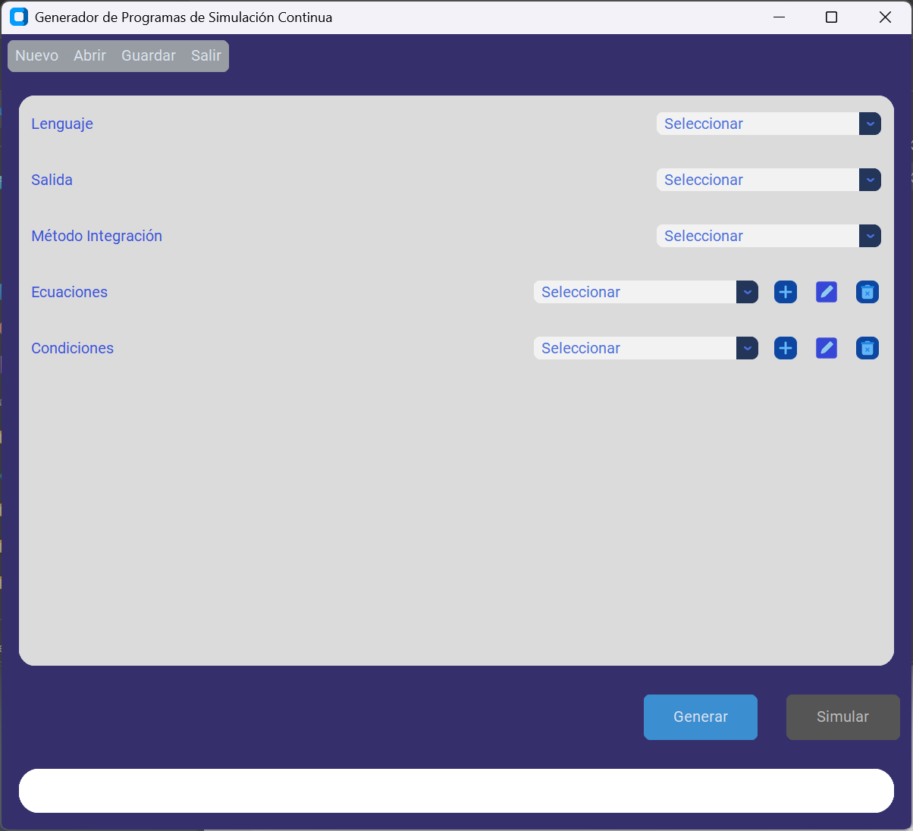
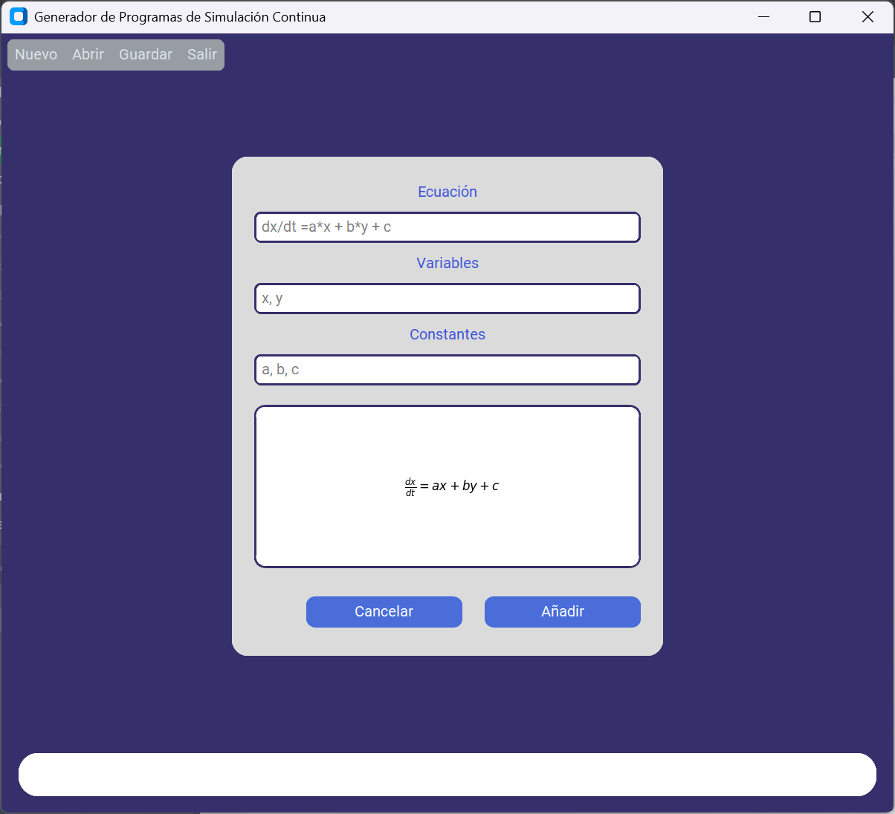
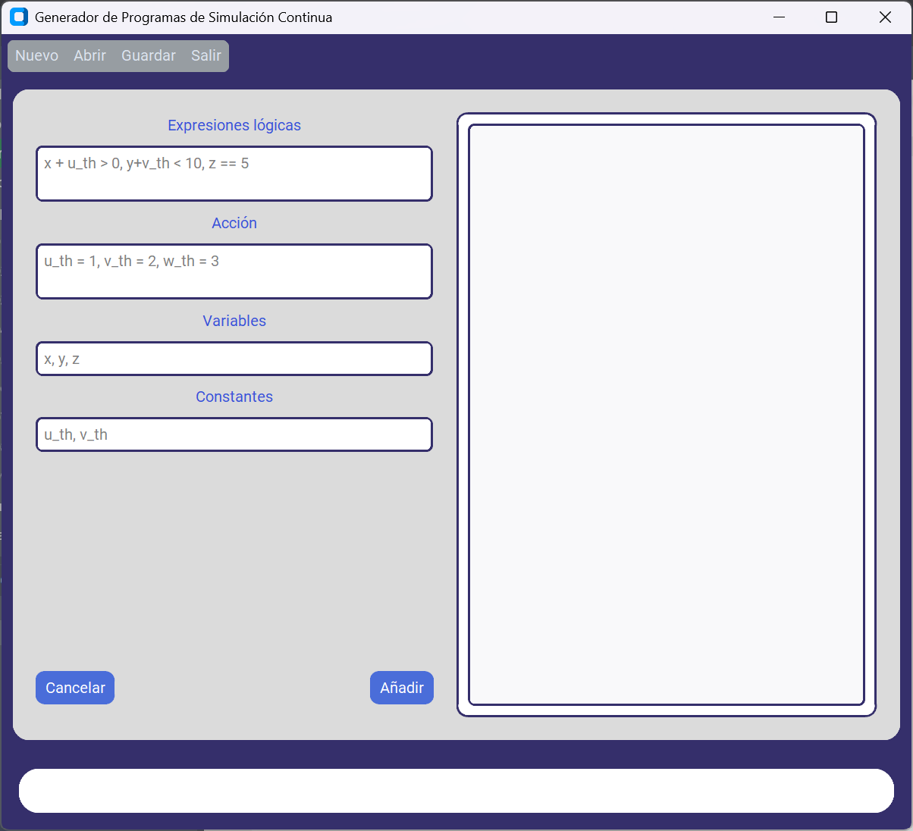
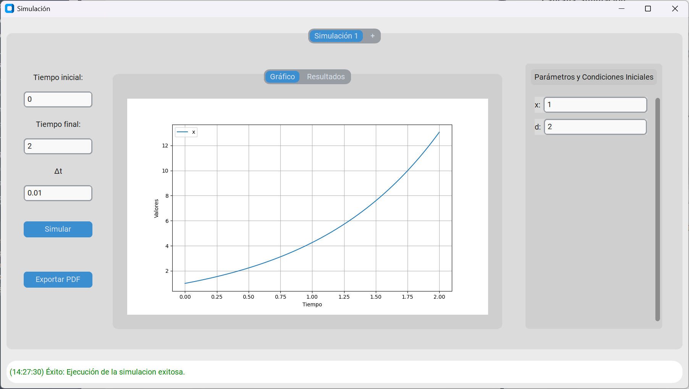

# 🧪 Generador Automático de Programas de Simulación Continua

Este proyecto es el resultado de un Trabajo de Fin de Grado (TFG) realizado en la Escuela Técnica Superior de Ingenierías Informática y de Telecomunicación (ETSIIT), Universidad de Granada. La herramienta permite generar automáticamente programas orientados a la simulación continua, a partir de ecuaciones diferenciales definidas por el usuario, con salida en distintos lenguajes de programación.

---

## 🎯 Objetivo

Automatizar el desarrollo de programas de simulación continua (basados en ecuaciones diferenciales) en **Python**, **C++** y **Java**, permitiendo al usuario:

- Definir ecuaciones y condiciones frontera.
- Seleccionar el lenguaje de salida.
- Elegir el método de integración numérica.
- Ejecutar simulaciones y visualizar los resultados desde la interfaz gráfica.

---

## 🛠️ Tecnologías utilizadas

- **Python 3.10+**
- **CustomTkinter** – Interfaz gráfica moderna
- **SymPy** – Manipulación simbólica de ecuaciones
- **Matplotlib** – Gráficos de simulación
- **Subprocess** – Ejecución de código externo
- **Pandas / NumPy** – Procesamiento de resultados
- **C++ / Java / Python** – Lenguajes objetivo para la generación automática de código

---

## ✨ Funcionalidades principales

- ✅ Generación de código fuente en 3 lenguajes
- ✅ Ejecución directa del código desde la aplicación
- ✅ Guardado/Cargado de archivos de configuración
- ✅ Visualización gráfica de resultados
- ✅ Modularidad y extensibilidad del sistema
- ✅ Exportación de resumen de la simulación a formato PDF

---

## 📁 Estructura del proyecto

```plaintext
TFG-MODELOS-CONTINUOS/
│
├── ContinuousModelGenerator/           # Módulo principal de la aplicación
│   ├── resources/img/                  # Imágenes para botones e interfaz 
│   │   ├── add.png
│   │   ├── delete.png
│   │   └── edit.png
│   │
│   ├── translators/                    # Módulo de traductores de código
│   │   ├── cpp_translator.py           # Traduce a código C++
│   │   ├── java_translator.py          # Traduce a código Java
│   │   ├── python_translator.py        # Traduce a código Python
│   │   └── translator.py               # Clase base abstracta
│   │
│   ├── view/                           # Vistas de la interfaz gráfica (CustomTkinter)
│   │   ├── condition_view_ctk.py       # Vista para condiciones iniciales
│   │   ├── equation_view_ctk.py        # Vista para introducir ecuaciones
│   │   ├── main_view_ctk.py            # Vista principal de la aplicación
│   │   └── simulation_view.py          # Vista de resultados de simulación
│   │
│   ├── controller.py                   # Controlador general (patrón MVC)
│   ├── conditions.py                   # Lógica para condiciones iniciales
│   ├── equation.py                     # Lógica simbólica para ecuaciones
│   ├── generator.py                    # Punto de entrada de la aplicación
│   ├── log_codes.py                    # Códigos de log definidos
│   ├── log_handler.py                  # Manejador de logs
│   └── model.py                        # Modelo de datos principal
│
├── dist/                               # Ejecutables generados por PyInstaller
│   ├── GeneratorSimulator              # Ejecutable Linux
│   └── GeneratorSimulator.exe          # Ejecutable Windows
│
├── models/                             # (Opcional) Códigos fuente generados por el usuario
├── test/                               # Archivos de configuración de ejemplo
├── generator.spec                      # Configuración de PyInstaller
├── requirements.txt                    # Lista de dependencias
├── setup.py                            # Script de instalación (pip install)
└── TFG-Modelos-Continuos.rar           # Proyecto completo comprimido
```
---

## 🖼️ Capturas de pantalla

**Interfaz principal:** permite seleccionar el lenguaje de programación, el método de integración, la carpeta de salida y acceder a los formularios para definir ecuaciones y condiciones. También incluye botones para generar el código o ejecutar la simulación.



---
**Editor de ecuaciones:** formulario dedicado a la introducción de ecuaciones diferenciales. El usuario puede introducir expresiones matemáticas simbólicas que serán procesadas y traducidas automáticamente al lenguaje seleccionado.



---
**Editor de condiciones:** permite especificar condiciones de frontera que forman parte del modelo continuo.



---
**Ventana de simulación:** Permite la visualización de forma gráfica y tabular resultante de la simulación del modelo. Contiene herramientas para tener varias simulaciones al mismo tiempo y la exportación de un resumen en formato PDF.



---

## 🚀 Cómo ejecutar el proyecto

### Opción 1: Clonar e instalar el proyecto con `pip`

1. Clona este repositorio:
   ```bash
   git clone https://github.com/josepise/TFG-Modelos-Continuos.git
   cd TFG-Modelos-Continuos
2. Instala el paquete localmente para acceder al comando cmg:
    ```bash
    pip install .
3. Ejecuta la aplicación desde cualquier terminal:
    ```bash
    cmg
### Opción 2: Usar los ejecutables ya generados
Ve a la carpeta dist/ y ejecuta el archivo correspondiente a tu sistema operativo:

- En Windows:
    ```bash
    ./dist/GeneratorSimulator.exe
- En Linux:
    ```bash
    ./dist/GeneratorSimulator
    ```
     **Nota**: Si el ejecutable no se inicia por permisos en Linux, puedes usar:
    >
    > ```bash
    > chmod +x GeneratorSimulator
    > ./GeneratorSimulator
    > ```

## ⚙️ Sobre los programas generados

Los programas generados por esta herramienta son **completamente autónomos**. Es decir, una vez creado el código fuente en el lenguaje elegido (C++, Python o Java), **no dependen de esta aplicación** para su ejecución ni compilación.

Cada programa generado incluye una función principal que acepta los **valores de las condiciones iniciales y los parámetros de integración como argumentos por línea de comandos**, lo que permite su uso en scripts, terminales o sistemas embebidos.

### 🧪 Ejemplo de ejecución de un programa generado

- **Python**:
  ```bash
  python modelo_generado.py 5 0 10 0.01
  ```
- **C++**:
    ```bash
    g++ modelo_generado.cpp -o modelo_generado
    ./modelo_generado 5 0 10 0.01
    ```
- **Java**:
    ```bash
    javac ModeloGenerado.java
    java ModeloGenerado 5 0 10 0.01 
    ```
  Donde los argumentos podrían representar:

    - Valor inicial de la variable: 5
    - Tiempo inicial: 0
    - Tiempo final: 10
    - Paso/Tolerancia: 0.01

En el caso de que se indique un número de argumentos no válido, el código generado contiene elementos de comprobación que si fuera el caso, mostraría un mensaje de error indicando el número de argumentos y la posición de cada componente de la simulación.

La ejecución del programa generado dará lugar a la creación de un archivo `nombre_programa.csv` que contendrá los resultados provenientes de la simulación.

## 🏅 Calificación del Trabajo

Este Trabajo de Fin de Grado fue **defendido y evaluado con una calificación de 10/10** por el tribunal académico, destacando la calidad técnica del desarrollo, la utilidad de la herramienta y la documentación presentada.

